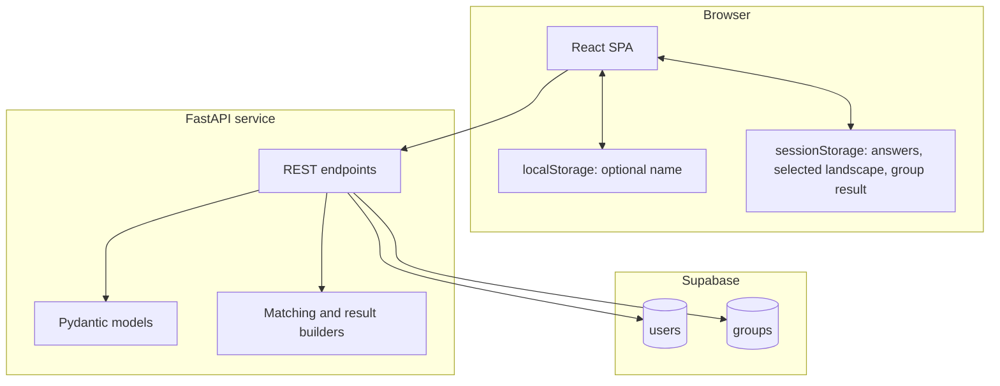
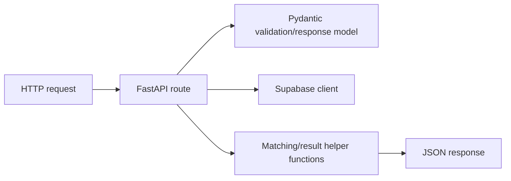
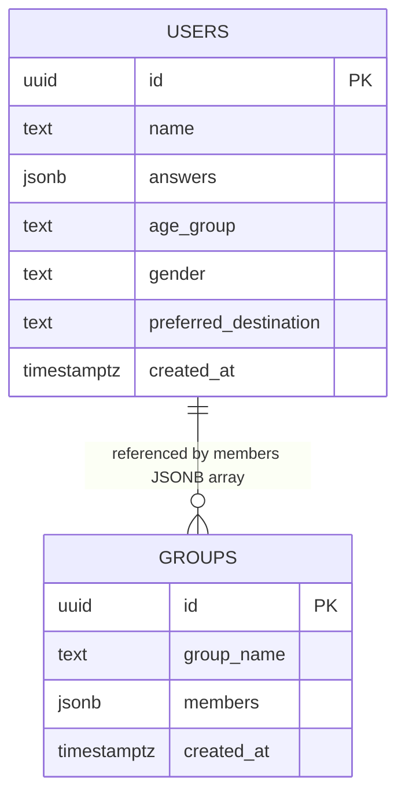
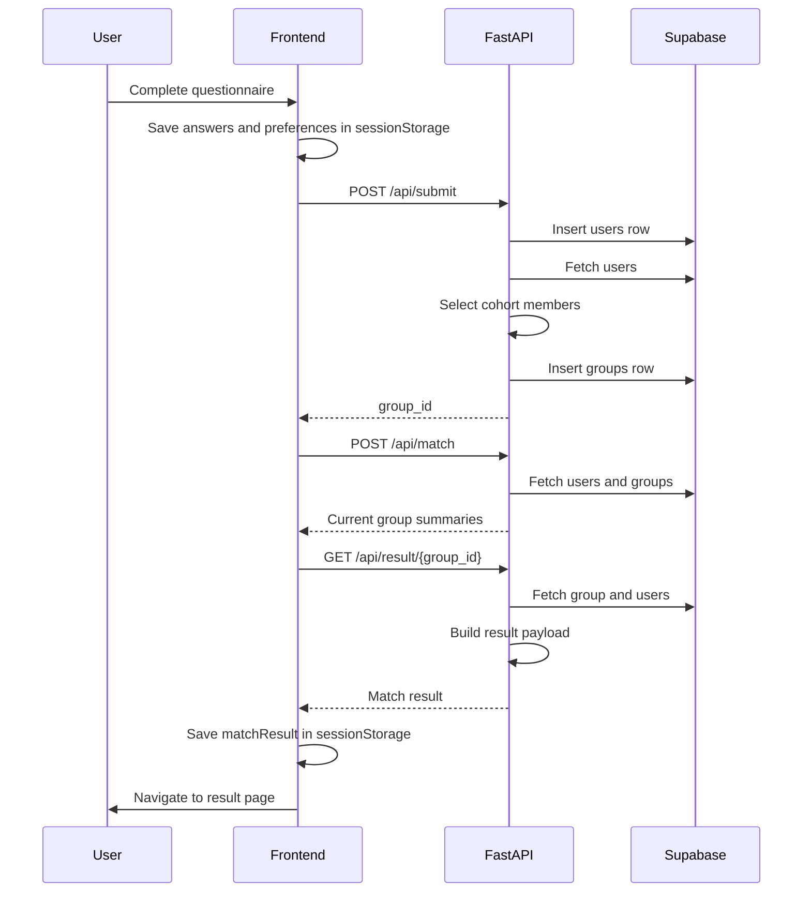
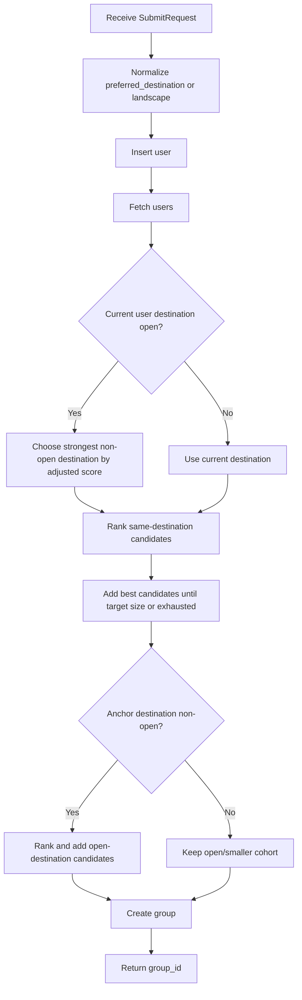
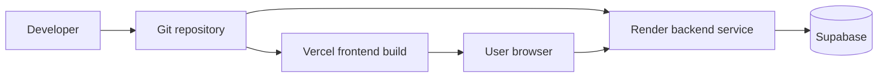

# Architecture

## System Overview

The Offline Co. is an MVP full-stack application with a React/Vite single-page frontend and a FastAPI backend. Supabase Postgres stores questionnaire submissions and generated groups. The application does not currently include authentication, server-side sessions, payment processing, or AI model inference.

## Frontend Architecture

The frontend is a Vite React app using TanStack Router file routes.

| Area | Files | Responsibility |
| --- | --- | --- |
| App entry | `src/index.tsx`, `src/router.tsx`, `src/routeTree.gen.ts` | Mounts React and configures generated TanStack Router routes. |
| Routes | `src/routes/*.tsx` | Page-level user flows: landing, questionnaire, loading, result, plan, root metadata/404. |
| Site components | `src/components/site/` | Landing navigation, reveal animations, footer, waitlist form. |
| UI primitives | `src/components/ui/` | Reusable UI controls and layout primitives. |
| Shared config | `src/config.ts` | Frontend API base URL. |
| Assets | `src/assets/` | Logo and destination imagery. |
| Styling | `src/styles.css` | Tailwind v4, theme tokens, custom classes, animations. |

### Client State

The MVP uses browser storage rather than authenticated user sessions.

| Storage | Keys | Purpose |
| --- | --- | --- |
| `localStorage` | `user_name` | Optional display name entered in the questionnaire. |
| `sessionStorage` | `selectedAtmosphere`, `selectedLandscape`, `selectedAge`, `selectedGender`, `answers`, `contactEmail`, `contactWhatsapp`, `groupId`, `matchResult` | Carries questionnaire, contact, group, and result data across frontend routes. |

## Backend Architecture

The backend is a single FastAPI app in `backend/main.py`.

| Module | Responsibility |
| --- | --- |
| `backend/main.py` | API routes, Supabase client initialization, matching functions, group/result builders. |
| `backend/models.py` | Pydantic request and response models. |
| `backend/supabase_users_schema.sql` | Minimal database schema and safe migration. |
| `backend/requirements.txt` | Python runtime dependencies. |

## Database Architecture

The database is intentionally minimal.

Important limitation: `groups.members` is a JSONB array of user IDs, not a normalized join table or declared foreign key.

## Request Flow

## Matching Flow

## Deployment Architecture

Recommended production split:

- Frontend: Vercel static build (`dist`) with SPA rewrites.
- Backend: Render Python web service running Uvicorn.
- Database: Supabase Postgres initialized with the schema SQL.

## Current Architectural Limitations

- No authentication or authorization layer.
- Backend uses Supabase anon key and wildcard CORS.
- No payment provider integration despite reservation copy.
- No implemented backend waitlist endpoint despite frontend best-effort calls.
- No normalized membership table.
- No database indexes beyond primary keys.
- `/api/match` summarizes existing groups rather than creating new matches.
- Matching is deterministic and heuristic, not machine-learning or AI based.
