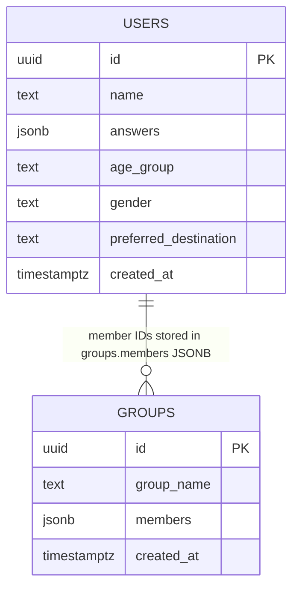

# Database Documentation

The application uses Supabase Postgres with a minimal MVP schema defined in `backend/supabase_users_schema.sql`.

## Current Schema

```sql
create table if not exists public.users (
    id uuid primary key default gen_random_uuid(),
    name text,
    answers jsonb not null,
    age_group text,
    gender text,
    preferred_destination text default 'open',
    created_at timestamp with time zone not null default now()
);

create table if not exists public.groups (
    id uuid primary key default gen_random_uuid(),
    group_name text,
    members jsonb not null default '[]'::jsonb,
    created_at timestamp with time zone not null default now()
);

alter table if exists public.users
    add column if not exists preferred_destination text default 'open';
```

## Entity Relationship Diagram



## Tables

### `public.users`

Stores questionnaire submissions.

| Column | Type | Nullable | Default | Purpose |
| --- | --- | --- | --- | --- |
| `id` | `uuid` | No | `gen_random_uuid()` | Primary key and member identifier used inside group JSONB arrays. |
| `name` | `text` | Yes | None | Optional display name. |
| `answers` | `jsonb` | No | None | Array of questionnaire answer integers. |
| `age_group` | `text` | Yes | None | Age range used in matching. |
| `gender` | `text` | Yes | None | Gender value used in matching. |
| `preferred_destination` | `text` | Yes | `'open'` | Destination key used by grouping logic. |
| `created_at` | `timestamp with time zone` | No | `now()` | Creation timestamp. |

### `public.groups`

Stores generated cohorts.

| Column | Type | Nullable | Default | Purpose |
| --- | --- | --- | --- | --- |
| `id` | `uuid` | No | `gen_random_uuid()` | Primary key returned to the frontend as `group_id`. |
| `group_name` | `text` | Yes | None | Destination-based cohort name. |
| `members` | `jsonb` | No | `'[]'::jsonb` | Array of user IDs as strings. |
| `created_at` | `timestamp with time zone` | No | `now()` | Creation timestamp. |

## Relationships

There are no declared foreign keys. The application treats `groups.members` as an array of `users.id` values.

Implications:

- Supabase/Postgres does not enforce that group member IDs exist in `users`.
- Deleting a user can leave stale IDs inside existing groups.
- Querying groups by user membership is less efficient than with a normalized join table.

## Indexes

Current explicit indexes:

| Table | Index | Source |
| --- | --- | --- |
| `users` | Primary key index on `id` | Created by `primary key`. |
| `groups` | Primary key index on `id` | Created by `primary key`. |

No additional indexes are defined for `preferred_destination`, `created_at`, or JSONB membership lookup.

## Data Shapes Used by Application

### `users.answers`

Expected to be a JSON array of integers from the frontend questionnaire:

```json
[4, 2, 5, 3, 4, 2, 5, 2, 4, 5, 2, 3, 4, 5]
```

The backend validates that at least one answer exists, but the database does not validate length or numeric range.

### `groups.members`

Expected to be a JSON array of user ID strings:

```json
[
  "8d20f8fc-f3cc-4c47-bb0f-8f2f2ad215ec",
  "0f0ef5bb-0cf2-4c13-9e55-89b3dc0f30ce"
]
```

## Current Limitations

- No `waitlist` table despite frontend waitlist submissions.
- No `payments`, `bookings`, or `reservations` tables despite reservation copy in the UI.
- No normalized `group_members` join table.
- No database-level constraints for supported destination values.
- No database-level validation for questionnaire answer count or scale.
- No Row Level Security policies documented in this repository.
- No migration framework; schema is a single SQL file.

## Future Improvements

These are recommendations only and are not implemented in the current codebase:

1. Add a `group_members` join table with foreign keys to `users` and `groups`.
2. Add a `waitlist_submissions` table if the existing frontend waitlist flow should persist leads.
3. Add `bookings` and `payments` tables when payment integration is implemented.
4. Add indexes for `users.preferred_destination`, `users.created_at`, and group membership queries.
5. Add check constraints for allowed destination values.
6. Add RLS policies that match the intended security model.
7. Adopt a migration tool or versioned SQL migration directory.
