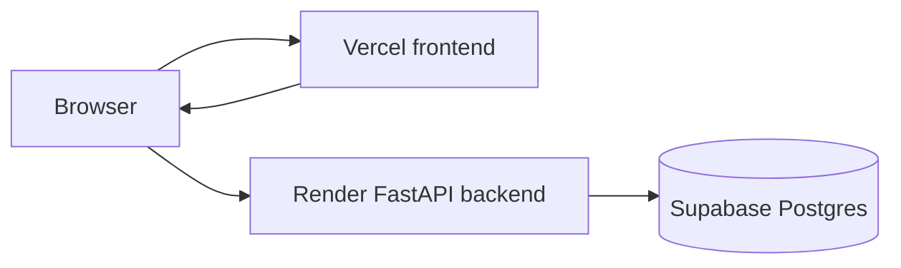

# Deployment Guide

## Overview

Recommended deployment split:

- Frontend: Vercel static site from Vite build output.
- Backend: Render Python web service running FastAPI/Uvicorn.
- Database: Supabase Postgres.



## Environment Variables

| Variable | Service | Required | Description |
| --- | --- | --- | --- |
| `VITE_API_BASE` | Frontend | Recommended | Backend API base URL. |
| `SUPABASE_URL` | Backend | Yes | Supabase project URL. |
| `SUPABASE_ANON_KEY` | Backend | Yes | Supabase anon key. |
| `PORT` | Backend | Usually provided by host | Backend port. Defaults to `10000` only when running `backend/main.py` directly. |

## Supabase Setup

1. Create a Supabase project.
2. Open SQL Editor.
3. Run `backend/supabase_users_schema.sql`.
4. Confirm these tables exist:
   - `public.users`
   - `public.groups`
5. Copy project URL and anon key into backend deployment environment variables.

## Render Backend

### Suggested Settings

| Setting | Value |
| --- | --- |
| Runtime | Python |
| Build command | `pip install -r backend/requirements.txt` |
| Start command | `cd backend && uvicorn main:app --host 0.0.0.0 --port $PORT` |
| Environment variables | `SUPABASE_URL`, `SUPABASE_ANON_KEY` |

### Health Check

After deployment, open:

```text
https://your-render-service.onrender.com/
```

Expected response:

```json
{
  "status": "Backend is running"
}
```

## Vercel Frontend

### Suggested Settings

| Setting | Value |
| --- | --- |
| Framework preset | Vite |
| Install command | `npm install` |
| Build command | `npm run build` |
| Output directory | `dist` |
| Environment variables | `VITE_API_BASE=https://your-render-service.onrender.com` |

`vercel.json` rewrites all routes to `/index.html`, which is required for direct visits to `/questionnaire`, `/loading`, `/result`, and `/plan`.

## Local Production Build Check

```bash
npm install
npm run build
npm run preview
```

Backend local check:

```bash
cd backend
python -m venv .venv
source .venv/bin/activate
pip install -r requirements.txt
SUPABASE_URL="..." SUPABASE_ANON_KEY="..." uvicorn main:app --host 0.0.0.0 --port 10000
```

## Cloudflare Wrangler Note

A `wrangler.jsonc` file exists, but it references `@tanstack/react-start/server-entry` while this repository is currently structured as a Vite SPA. Treat Cloudflare deployment as unverified until configuration is aligned with the actual app entry and build output.

## Troubleshooting

| Problem | Cause | Resolution |
| --- | --- | --- |
| Backend startup crash | Missing Supabase env vars. | Add `SUPABASE_URL` and `SUPABASE_ANON_KEY`. |
| Frontend calls wrong backend | `VITE_API_BASE` not set. | Set it in Vercel and rebuild. |
| Deep link 404 on Vercel | SPA rewrite missing or ignored. | Verify `vercel.json` is deployed. |
| Supabase `preferred_destination` errors | Existing project lacks new column. | Run the safe migration in `backend/supabase_users_schema.sql`. |
| Loading flow fails | Backend, Supabase, or schema issue. | Check browser network tab and Render logs. |
| Waitlist submissions disappear | Backend route/table not implemented. | Implement a waitlist endpoint/table in a future code change. |
| Payment unavailable | No payment integration exists. | Add payment provider integration in a future code change. |
