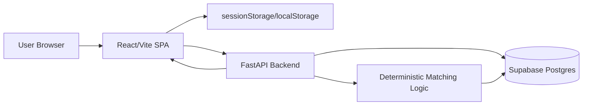

# The Offline Co.

The Offline Co. is a web application for curating small, offline weekend cohorts around emotional compatibility, questionnaire responses, and destination atmosphere preferences. The product presents a premium landing experience, collects a short application-style questionnaire, stores respondents in Supabase, creates a pilot cohort, and returns a personalized match result and reservation-plan page.

> Status: MVP/prototype. Core questionnaire, matching, result, and plan flows exist. Payment and waitlist persistence are referenced in the frontend, but no backend waitlist or payment endpoint exists in this repository.

## Problem Statement

Highly connected users often struggle to find meaningful in-person social experiences. Typical event and travel products optimize for availability, price, or content; this project focuses on emotional pace, offline presence, and small curated groups.

## Solution

The Offline Co. combines:

- A premium editorial landing page for an offline weekend concept.
- A questionnaire that captures social-energy preferences, age range, gender, and destination atmosphere.
- A FastAPI backend that stores submissions in Supabase.
- A deterministic MVP matching flow that creates a cohort around destination fit and compatibility scores.
- A result page that explains the user's cohort, score, match reasons, destination theme, and activity plan.
- A plan page that shows weekend dates, reveal timing, packing guidance, and itinerary copy.

## Key Features

| Area | Implemented behavior |
| --- | --- |
| Landing page | Editorial hero, sections for concept/experiences/how-it-works/pricing, responsive navigation, waitlist form with graceful degradation. |
| Questionnaire | Landscape selection, optional name, age range, gender, 14 Likert-style questions, contact capture, session/local storage handoff. |
| Matching | Supabase user insert, cohort creation, destination normalization, compatibility scoring, demographic bonuses, group result generation. |
| Results | Animated reveal, match score, reasons, group member labels, destination atmosphere, suggested activity plan, share/plan CTA. |
| Plan page | Destination-specific stay/weather/packing/schedule content, weekend selection, 24-hour reveal countdown. |
| Backend API | Health check, submit, match summary, group result endpoints. |
| Database | Minimal Supabase schema with `users` and `groups` tables. |

## Screenshots

Screenshots are not committed in this repository. Suggested placeholders for GitHub or investor materials:

| Screen | Placeholder |
| --- | --- |
| Landing | `docs/screenshots/landing.png` |
| Questionnaire | `docs/screenshots/questionnaire.png` |
| Loading | `docs/screenshots/loading.png` |
| Result | `docs/screenshots/result.png` |
| Plan | `docs/screenshots/plan.png` |

## Tech Stack

| Layer | Technologies |
| --- | --- |
| Frontend | React 19, TypeScript, Vite, TanStack Router, TanStack Query dependency, Tailwind CSS v4, Radix UI components, Framer Motion, Lucide icons. |
| Backend | Python, FastAPI, Uvicorn, Pydantic, Supabase Python client. |
| Database | Supabase Postgres with JSONB columns. |
| Deployment | Vercel-compatible frontend rewrite config, Render-style backend port usage, Cloudflare Wrangler config present but not aligned with the current Vite SPA entry. |
| AI components | No model inference or external AI API is implemented in the repository. Matching is deterministic application logic. |

## Architecture Overview



## Folder Structure

| Path | Purpose |
| --- | --- |
| `src/routes/` | TanStack Router pages for landing, questionnaire, loading, result, plan, and root metadata/404. |
| `src/components/site/` | Landing-page components including navigation, footer, reveal animation wrapper, and waitlist form. |
| `src/components/ui/` | Reusable shadcn/Radix-style UI primitives. |
| `src/components/` | Shared brand/theme components. |
| `src/assets/` | Logo and destination landscape images used by questionnaire/result/plan experiences. |
| `src/lib/` | Utility helpers. |
| `src/hooks/` | Shared React hooks. |
| `backend/` | FastAPI application, Pydantic models, requirements, and Supabase schema SQL. |
| Root config files | Vite, TypeScript, ESLint, Vercel, Wrangler, package managers, and UI component configuration. |

See [PROJECT_STRUCTURE.md](PROJECT_STRUCTURE.md) for a detailed file-by-file guide.

## Installation

### Frontend

```bash
npm install
npm run dev
```

The frontend defaults to `https://the-offline-co.onrender.com` unless `VITE_API_BASE` is set.

### Backend

```bash
cd backend
python -m venv .venv
source .venv/bin/activate
pip install -r requirements.txt
SUPABASE_URL="https://your-project.supabase.co" \
SUPABASE_ANON_KEY="your-anon-key" \
uvicorn main:app --reload --host 0.0.0.0 --port 10000
```

### Database

Run `backend/supabase_users_schema.sql` in Supabase SQL Editor to create the MVP tables and safe migration.

### Running Locally

1. Start the backend on port `10000`.
2. Set frontend env:

```bash
VITE_API_BASE=http://localhost:10000 npm run dev
```

3. Open the Vite local URL and complete the questionnaire.

## Environment Variables

| Variable | Used by | Required | Purpose |
| --- | --- | --- | --- |
| `VITE_API_BASE` | Frontend | Optional | Overrides the backend base URL. Defaults to `https://the-offline-co.onrender.com`. |
| `SUPABASE_URL` | Backend | Yes | Supabase project URL. Backend raises an exception at startup if missing. |
| `SUPABASE_ANON_KEY` | Backend | Yes | Supabase anon key used by the backend Supabase client. Backend raises an exception at startup if missing. |
| `PORT` | Backend | Optional | Port for direct `python main.py` execution. Defaults to `10000`. |

## API Documentation

The backend exposes four implemented endpoints. A frontend waitlist call to `/api/waitlist` exists, but no matching backend route is implemented.

| Method | Route | Purpose |
| --- | --- | --- |
| `GET` | `/` | Health check. |
| `POST` | `/api/submit` | Store a user submission, create a group, and return `group_id`. |
| `POST` | `/api/match` | Return summaries for existing groups; does not create new groups in the current implementation. |
| `GET` | `/api/result/{group_id}` | Return the personalized result for one group. |

See [API.md](API.md) for request/response schemas, status codes, validation, and business logic.

## Database Documentation

Current Supabase schema:

- `users`: questionnaire submissions and destination preference.
- `groups`: generated cohort records with JSONB member ID arrays.

See [DATABASE.md](DATABASE.md) for columns, relationships, indexes, limitations, and Mermaid ER diagram.

## Matching Algorithm

The matching algorithm is implemented in `backend/main.py` and is deterministic.

1. Normalize destination preferences into supported keys: `birbhum`, `dooars`, `kandhamal`, `satkosia`, or `open`.
2. Insert the current user into `users`.
3. Fetch existing users.
4. Select up to `TARGET_COHORT_SIZE = 7` members.
5. Prefer users with the same destination as the current user, or choose the strongest non-open destination for users who selected `open`.
6. Add open-destination users after exact destination candidates when the anchor destination is not `open`.
7. Rank candidates by adjusted match score plus small diversity bonuses.
8. Create a group row with the selected member IDs.

Compatibility details:

- Base score compares paired questionnaire answers using absolute distance.
- Maximum distance assumes a 1–5 scale, so each paired answer can differ by up to `4`.
- Raw score is `100 - distance/max_distance * 100`, clamped to `0..100` and converted to an integer.
- Adjusted score adds `+10` for same age group and `+5` for same gender, capped at `100`.
- Candidate selection adds `+4` when the candidate introduces a new age group among already selected users and `+3` when the candidate introduces a new gender.
- Ties use Python's `max` behavior over the remaining candidate list, meaning the first encountered highest-scoring candidate wins.

See [MATCHING_ALGORITHM.md](MATCHING_ALGORITHM.md) for the full flow.

## User Flow

```mermaid
flowchart TD
  Landing[/Landing page/] --> Questionnaire[/Questionnaire/]
  Questionnaire --> Contact[Contact capture]
  Contact --> Loading[/Loading page/]
  Loading --> Submit[POST /api/submit]
  Submit --> Match[POST /api/match]
  Match --> ResultFetch[GET /api/result/{group_id}]
  ResultFetch --> Result[/Result page/]
  Result --> Plan[/Plan page/]
  Plan --> PaymentNote[Payment copy only; no payment integration implemented]
```

## Deployment Guide

### Vercel Frontend

- Build command: `npm run build`
- Output directory: `dist`
- Set `VITE_API_BASE` to the deployed backend URL.
- `vercel.json` rewrites all routes to `/index.html` for SPA routing.

### Render Backend

- Runtime: Python.
- Build command: `pip install -r backend/requirements.txt`
- Start command from repo root: `cd backend && uvicorn main:app --host 0.0.0.0 --port $PORT`
- Environment: `SUPABASE_URL`, `SUPABASE_ANON_KEY`.

### Supabase

- Create a Supabase project.
- Run `backend/supabase_users_schema.sql`.
- Use the project URL and anon key in backend environment variables.

## Troubleshooting

| Issue | Likely cause | Fix |
| --- | --- | --- |
| Backend fails on startup | Missing `SUPABASE_URL` or `SUPABASE_ANON_KEY`. | Add both variables to the backend environment. |
| Questionnaire loading page shows “Something went wrong” | Backend unavailable, invalid API base, missing Supabase table, or no saved answers. | Check `VITE_API_BASE`, backend logs, Supabase schema, and browser session storage. |
| Supabase insert/fetch errors | Tables missing or schema differs from MVP SQL. | Run `backend/supabase_users_schema.sql`; verify `users` and `groups`. |
| Vercel deep links return 404 | SPA rewrite missing. | Keep `vercel.json` rewrite to `/index.html`. |
| Waitlist appears successful but no data exists | `/api/waitlist` is not implemented in the backend. | Add a backend waitlist route and table in a future application change. |
| Payment cannot complete | No payment provider or payment endpoint exists. | Integrate payment in a future application change. |

## Documentation Index

- [ARCHITECTURE.md](ARCHITECTURE.md)
- [API.md](API.md)
- [DATABASE.md](DATABASE.md)
- [MATCHING_ALGORITHM.md](MATCHING_ALGORITHM.md)
- [PROJECT_STRUCTURE.md](PROJECT_STRUCTURE.md)
- [DEPLOYMENT.md](DEPLOYMENT.md)
- [CONTRIBUTING.md](CONTRIBUTING.md)
- [SECURITY.md](SECURITY.md)
